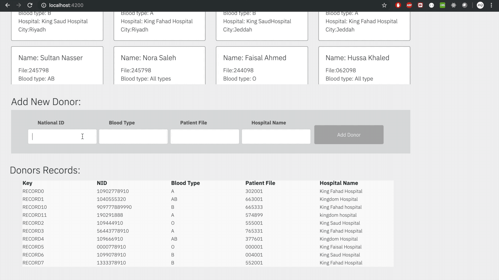

# Blood Donations Tracking System

>Hyperledger Fabric BDTS on IBM Blockchain Platform

Blood Donations Tracking System based on a network on the IBM Blockchain Platform and deploying the BDTS smart contract on the network. The application will interact with the network including identities to submit transactions on the smart contract.  The application is setup with a Node.js back-end server using the Fabric Node SDK to process requests to the network, and an Angular front-end to bring up a web interface.

# BDTS

  

 

# 
Add new record
  

 

# 
the new record added to the blockchain
  

